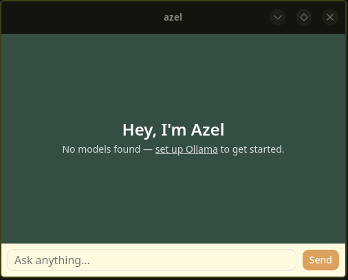
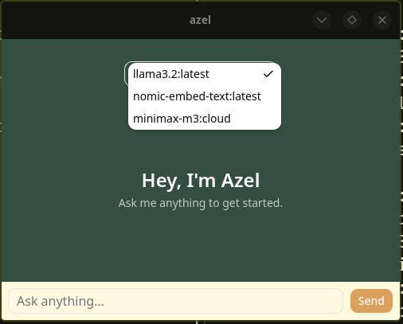

# Azel

A fast, native desktop chat app you can launch with one click — built with Tauri, letting you chat with local or remote AI models right from your desktop.

<table>
  <tr>
    <td></td>
    <td></td>
  </tr>
</table>
<!-- Replace with actual screenshots or a demo GIF before publishing -->

## Features

- Clean, native chat interface
- Lightweight — built with Tauri (Rust backend + web frontend), not Electron
- Switch between multiple AI models
- Quick-toggle floating window (Hyprland: `CTRL + SPACE`)
- Cross-platform: Linux, Windows, and macOS

## Installation

### Download (recommended)

Grab the latest release for your platform from the [Releases page](https://github.com/bizkda/azel/releases).

- **Linux:** `.deb` (Debian/Ubuntu) or `.rpm` (Fedora/RHEL/openSUSE). Arch/other distros — use the install script below.
- **Windows:** `.msi` or `.exe` (NSIS installer)
- **macOS:** `.dmg` — separate builds for Apple Silicon and Intel

### Linux install script (Arch and other distros)

For distros without `.deb`/`.rpm` support (e.g. Arch, CachyOS), use the included install script — it builds from source and sets Azel up as a proper desktop app (binary in `/usr/local/bin`, icon, and app launcher entry):

```bash
git clone https://github.com/bizkda/azel.git
cd azel
./install.sh
```

After that, launch Azel from your app menu/launcher (rofi, wofi, etc.) or by typing `azel` in a terminal.

### Hyprland: quick-toggle setup (optional)

If you're on Hyprland and want the `CTRL + SPACE` quick-toggle behavior (launch Azel instantly as a floating scratchpad window, hidden until summoned), run the included setup script **after** `install.sh`:

```bash
./install-hyprland.sh
```

This installs [Pyprland](https://github.com/hyprland-community/pyprland), auto-detects Azel's window class, and wires up the toggle for you. See [Configuration → Hyprland](#hyprland-quick-toggle-window) below for what it does and how to set it up manually if you prefer.

### Build from source (manual)

**Prerequisites:**
- [Node.js](https://nodejs.org/) (v18+)
- [Rust](https://rustup.rs/) toolchain
- [Tauri prerequisites](https://tauri.app/start/prerequisites/) for your OS

```bash
git clone https://github.com/bizkda/azel.git
cd azel
npm install
npm run tauri build
```

The built app and installers will be in `src-tauri/target/release/` (raw binary) and `src-tauri/target/release/bundle/` (platform installers — `.deb`/`.rpm` on Linux, `.msi`/`.exe` on Windows, `.dmg` on macOS).

> **Note:** cross-compiling isn't supported — building on Linux only produces Linux installers, building on Windows only produces Windows installers, and so on. To get all platforms, either build on each OS separately or use the GitHub Actions release workflow (see below).

## Usage

1. Launch Azel.
2. Select a model from the dropdown *(populated automatically from your available models)*.
3. Type your message and hit **Send** or press `Enter`.
4. Toggle the Azel window from anywhere with `CTRL + SPACE` *(Windows/macOS — built in. Hyprland — see Configuration below)*.

## Configuration

### Models

Azel automatically detects available models on startup. To add or configure model sources, edit:

```
~/.config/azel/config.toml
```
<!-- Update this path/format to match your actual config setup -->

### Hyprland: quick-toggle window

On Windows and macOS, `CTRL + SPACE` is handled natively by the app. On Hyprland (Wayland), global hotkeys have to be owned by the compositor rather than the app itself — so the toggle is implemented using [Pyprland](https://github.com/hyprland-community/pyprland)'s scratchpad plugin instead.

**Easiest way:** run `./install-hyprland.sh` (see Installation above) — it does everything below automatically, including detecting Azel's exact window class name.

**Manual setup**, if you'd rather configure it yourself:

1. Install Pyprland:
   ```bash
   yay -S pyprland   # or: paru -S pyprland / pip install --user pyprland
   ```

2. Create `~/.config/pypr/config.toml`:
   ```toml
   [pyprland]
   plugins = ["scratchpads"]

   [scratchpads.azel]
   command = "env GDK_BACKEND=x11 azel"
   class = "Azel"
   size = "40% 60%"
   lazy = true
   ```
   > Window class matching is case-sensitive — Azel's window class is `Azel` (capital A). Confirm with `hyprctl clients -j | jq '.[] | select(.class | test("azel"; "i")) | .class'` while it's running if this ever changes.

3. Add to `hyprland.conf`:
   ```ini
   exec-once = pypr
   bind = CTRL, SPACE, exec, pypr toggle azel

   windowrule {
       match:class = ^(Azel)$
       float = on
   }
   ```

4. Log out and back into your Hyprland session (so `exec-once = pypr` actually starts), then press `CTRL + SPACE`.

## Releasing (for maintainers)

New releases are built and published automatically via GitHub Actions for Linux, Windows, and macOS. To cut a new release:

```bash
git tag v0.2.0
git push origin v0.2.0
```

This triggers `.github/workflows/release.yml`, which builds all platform installers and attaches them to a **draft** GitHub Release. Review the draft, then publish it manually from the Releases tab.

## Tech stack

- **Frontend:** React + TypeScript
- **Backend:** Rust (Tauri)
- **Styling:** Tailwind CSS

## Troubleshooting

- **Hyprland: "Pypr can't connect. Is daemon running?"** — the Pyprland daemon isn't running yet. Run `pypr &` manually to start it, or log out/back in so `exec-once = pypr` takes effect automatically.
- **Hyprland: "Window does not qualify to be pinned"** — usually a window class mismatch. Confirm the real class with `hyprctl clients -j | jq '.[] | select(.class | test("azel"; "i")) | .class'` and make sure it matches exactly (case-sensitive) in both `~/.config/pypr/config.toml` and your `windowrule`.
- **Models not showing up:** confirm your model source is running/reachable, and check the config file path above.
                             and make sure ollama is runing by writing `ollama serve` in your terminal.

## License

MIT License — see [LICENSE](LICENSE) for details.
